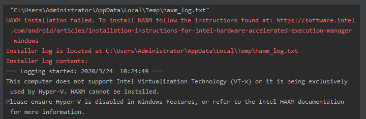
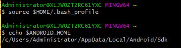

为了配合React Native端开发, 且处于Windows, 所以需要搭建Android开发环境. 

需要安装: Node, Watchman, 命令行工具, JDK, Android Studio. 

### Java Development Kit
> React Native 需要 Java Development Kit [JDK] 1.8（暂不支持 1.9 及更高版本）. 

[JDK下载地址](https://www.oracle.com/java/technologies/javase-jdk8-downloads.html)

### Android 开发环境
> 国内用户必须必须必须有稳定的翻墙工具, 否则在下载、安装、配置过程中会不断遭遇链接超时或断开, 无法进行开发工作. 若安装过程中出现报错等99%是无法正常翻墙造成. 

[购买服务并配置可看前一篇文章](./vultr-ss)

- #### 安装 Android Studio

    [下载安装 Android Studio](https://developer.android.com/studio/index.html)

    安装界面中选择"Custom"选项, 确保选中了以下几项: 
    1) Android SDK
    2) Android SDK Platform
    3) Performance (Intel ® HAXM) ([AMD 处理器看这里](https://android-developers.googleblog.com/2018/07/android-emulator-amd-processor-hyper-v.html))
    4) Android Virtual Device

    问题:

    1) HAXM installation failed
    
    Intel Virtualization Technology（VT-x）没有开启, 所以需要进入bios进行开启Intel Virtualization Technology（VT-x）的操作.
    2) Unable to run Intel HAXM installer: Cannot start process, the working directory 

        Download HAXM directly from Intel website, [here](https://github.com/intel/haxm/releases/tag/v7.5.6)

        因为在原来的开发中使用到了docker, 所以电脑已安装Hyper-v, 但是vt-x和Hyper-v不能共存所以会导致HAXM安装失败, 所以需要开发Android时需要关闭Hyper-v. [操作方法](https://blog.csdn.net/Coco_chun/article/details/90261678)

        ```bash
        bcdedit /set hypervisorlaunchtype off 

        // 之后重启电脑，这时候你再去安装haxm就可以了

        // 重启hyper-v 
        bcdedit / set hypervisorlaunchtype auto
        ```


- #### 安装 Android SDK

    Android Studio 默认会安装最新版本的 Android SDK. 目前编译 React Native 应用需要的是 Android 6.0 (Marshmallow) 版本的 SDK（注意 SDK 版本不等于终端系统版本, RN 目前支持 android 4.1 以上设备）. 可以在 Android Studio 的 SDK Manager 中选择安装各版本的 SDK. 

    可以在 Android Studio 的欢迎界面中找到 SDK Manager. 点击 "Configure", 然后就能看到 "SDK Manager". 

    

    > SDK Manager 还可以在 Android Studio 的 "Preferences" 菜单中找到. 具体路径是 Appearance & Behavior → System Settings → Android SDK. 

    

    在 SDK Manager 中选择 "SDK Platforms"选项卡, 然后在右下角勾选 "Show Package Details". 展开 Android 6.0 (Marshmallow) 选项, 确保勾选了下面这些组件（重申你必须使用稳定的翻墙工具, 否则可能都看不到这个界面）: 

    - Android SDK Platform 28
    - Intel x86 Atom_64 System Image（官方模拟器镜像文件, 使用非官方模拟器不需要安装此组件）

    然后点击"SDK Tools"选项卡, 同样勾中右下角的"Show Package Details". 展开"Android SDK Build-Tools"选项, 确保选中了 React Native 所必须的 23.0.1 版本. 你可以同时安装多个其他版本, 然后还要勾选最底部的 Android Support Repository. 

    最后点击"Apply"来下载和安装这些组件. 

- #### 配置 ANDROID_HOME 环境变量

    React Native 需要通过环境变量来了解你的 Android SDK 装在什么路径, 从而正常进行编译. 

    具体的做法是把下面的命令加入到 ~/.bash_profile 文件中(使用bash在终端下使用`vi ~/.bash_profile`命令创建或编辑): 
    ```bash
    # Windows
    export ANDROID_HOME=$HOME/AppData/Local/Android/Sdk # 在 Android Studio 的 "Preferences" 菜单中查看 SDK 的真实路径, 具体是Appearance & Behavior → System Settings → Android SDK. 
    export PATH=$PATH:$ANDROID_HOME/build-tools
    export PATH=$PATH:$ANDROID_HOME/platform-tools
    ```

    保存后:
    ```bash
    source $HOME/.bash_profile # 使环境变量设置立即生效

    echo $ANDROID_HOME # 检查此变量是否已正确设置
    ```

    

- #### 最后可以通过Androd真机或者模拟器进行调试

    1) 将真机用 usb 数据线连接到电脑, 然后遵照[在设备上运行](https://reactnative.cn/docs/0.55/running-on-device)这篇文档的说明操作即可.

    2) 在 Android Studi 打开 "AVD Manager" 来查看可用的虚拟设备, 可点击"Create Virtual Device...", 然后选择所需的设备类型并点击"Next"来创建新的模拟设备


[本文教程参考: Taro 搭建Android开发环境](https://nervjs.github.io/taro/docs/react-native.html#%E6%90%AD%E5%BB%BA-android-%E5%BC%80%E5%8F%91%E7%8E%AF%E5%A2%83)