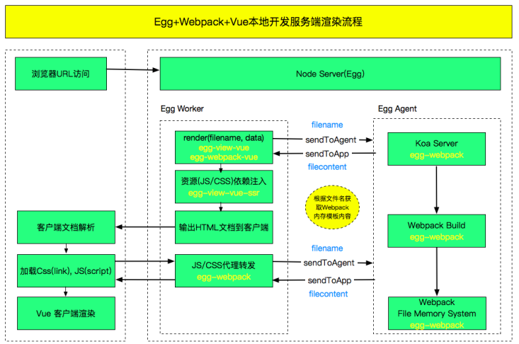

参考: [Egg Vue SSR/CSR 工程化](https://www.yuque.com/easy-team/egg-vue)

> 基于 Egg + Vue + Webpack SSR 服务端渲染和 CSR 前端渲染工程骨架项目，包括前台系统(SSR MPA)和后台管理系统(SSR SPA)

- Node 端基于 Egg 开发，遵循 Egg 开发规范和 Egg 生态，支持 Egg 所有特性，比如插件机制，多进程机制。
- 使用 TypeScript 或 JavaScript 编写前端和 Node 端代码，支持 ts-node 无编译 和 Webpack 编译开发模式。
- 前端基于 Vue 框架，默认支持 Vue 服务端渲染，前端渲染模式，Asset 渲染，HTML 渲染多种渲染模式。
- 集成 Css/Sass/Less/Stylus 以及 Css Module 多种样式编写构建支持， 可以按需选用。
- 整合 Egg,  Webpack, TypeScript 构建工具，内置多进程，Webpack DLL 和缓存等编译提速解决方案，并提供强大的 CLI 开发工具。

## Vue 服务端渲染（SSR - Server Side Render)

Vue 服务端渲染指的是编写的 Vue 组件在 Node 服务端直接编译成完整的 HTML, 然后直接输出给浏览器，用户就能快速的看到内容. 服务端渲染的页面在浏览器里面你右键源代码可以看到完整的 HTML 页面结构, 包括 id='app' 节点里面所有内容； 而目前所说的 Vue 前端渲染你只能看到简单的 html, body, script 结构，id='app' 节点里面的实际内容在浏览器前端渲染出来的。

Vue 服务端渲染构建是需要构建两份 JSBundle 文件。SSR 模式开发时，SSR 运行需要 Webapck 单独构建 target: node 和 target: web 的 JSBundle，主要的差异在于 Webpack 需要处理 require 机制以及磨平 Node 和浏览器运行环境的差异。服务端的 JSBundle 用来生产 HTML，客户端的 JSBundle 需要 script 到文档，用来进行事件绑定等操作，也就是 Vue 的 hydrate 机制。

本地构建是 Webpack 内存构建，文件不落地磁盘，所以 app/view 和 public 在本地开发时，是看不到文件的。 只有发布模式(npm run build)才能在这两个目录中看到构建后的内容。



## Egg Vue SSR 发布模式渲染方式

1. Webpack 通过本地构建或者 ci 直接构建好服务端文件和客户端资源文件到磁盘
2. Egg render 直接读取本地文件, 然后渲染成 HTML
3. 根据 manfifest.json 文件注入 jss/css 资源依赖注入
4. 模板渲染完成, 服务器输出 HTML 内容给浏览器

## 特性支持

- 支持服务端渲染 SSR(Server Side Render), 前端渲染 CSR(Client Side Render) 方式<br />
- 支持 Node 和 前端代码修改, Webpack 自动编译和热更新, `npm run dev` 一键启动应用<br />
- 基于 vue + axios 多页面服务端渲染, 客户端渲染同构实现, 支持 asyncData 渲染<br />
- 基于 vue + vuex + vue-router + axios 单页面服务器客户端同构实现<br />
- 支持 js/css/image 资源依赖, 内置支持 CDN 特性, 支持 css/sass/less 样式编写<br />
- 支持根据 .vue 文件自动创建 Webpack Entry 入口文件<br />
- 开始支持多进程和缓存编译， 支持 Webpack dll 自动化构建, 与多进程编译结合，构建速度减少 2/3<br />
- 支持 Vue 组件 import 异步加载, 具体实例请看[app/web/page/dynamic](https://github.com/easy-team/egg-vue-webpack-boilerplate/tree/awesome/app/web/page/dynamic)<br />
- 支持服务端渲染(SSR)失败时，自动降级为前端渲染(CSR)模式<br />
- 提供 国际化 i18n 多语言支持方案<br />

## 开发

### easywebpack-cli 脚手架安装并初始化

```bash
npm install easywebpack-cli -g
easy init
yarn
```

### 项目运行

```bash
npm run dev   // egg-bin dev
```

- 启动 Egg 应用（读取 config/config.local.js 配置）
- 启动 Webpack 构建, 构建文件存储在内存不落地磁盘(只在本地启动,  发布模式是提前构建好文件到磁盘)
- 构建会同时启动两个 Webpack 构建服务, 客户端 js 构建端口 9000, 服务端端口 9001
- 构建完成，Egg 应用正式可用，自动打开浏览器

### 发布模式

```bash
npm run build
```

1. 启动 Webpack 构建，文件落地磁盘
2. 服务端构建的文件放到 `app/view` 目录
3. 前端构建的文件放到 `public` 目录
4. 生成的 `manifest.json` 放到 `config` 目录
5. 构建的文件都是 gitignore 的，**部署时请注意把这些文件打包进去**

```bash
npm start  // egg-scripts start
```

    非egg-scripts start方式启动时， 启动应用前， 设置EGG_SERVER_ENV环境变量，测试环境设置 test， 正式环境设置 prod。

### 项目构建

构建会根据 webpackConfigList.length 启动对应个数的 Webpack 编译实例，这里会同时启动两个 Webpack 构建服务, 客户端 jsbundle 构建，端口 9000, 服务端 jsbundle 构建端口 9001。默认端口为 9000, 端口依次递增。

```js
// config/config.local.js 本地 npm start 使用
const EasyWebpack = require("easywebpack-vue");
exports.webpack = {
  webpackConfigList: EasyWebpack.getWebpackConfig(),
};
```

app/web/page 目录中所有 .vue 文件当作 Webpack 构建入口是采用 app/web/framework/vue/entry 的 client-loader.js 和 server-loader.js 模板实现的，这个需要结合 webpack.config.js 下的 entry.loader 使用。

```js
entry: {
   include: ['app/web/page'],
   exclude: ['app/web/page/[a-z]+/component', 'app/web/page/app'],
   loader: { // 如果没有配置loader模板，默认使用 .js 文件作为构建入口
      client: 'app/web/framework/vue/entry/client-loader.js',
      server: 'app/web/framework/vue/entry/server-loader.js',
   }
}
```

Vue 项目代码放到 app/web 目录，页面入口目录为 page，该目录的 所有 vue 文件默认会作为 Webpack 的 entry 构建入口。建议每个页面目录的只保留一个 vue 文件，vue 关联的组件可以放到 widget 或者 compnent 目录。如果非要放到当前目录，请配置 webpack.config.js entry.exclude 排除 vue 文件。

### 多页面服务端渲染

#### 多页面前端页面实现

Webpack 自动根据.vue 文件创建 entry 入口, webpack.config.js, home.vue 编写界面逻辑。

#### 多页面其他渲染实现

- 创建 controller 文件 home.js

  ```js
  // 多页面后端渲染实现, 通过 egg-view-vue-ssr 插件 render 方法实现
  exports.index = function* (ctx) {
    yield ctx.render("home/home.js", { message: "vue server side render!" });
  };

  // 多页面走前端渲染(后端路由)实现, 通过 egg-view-vue-ssr 插件 renderClient 方法实现
  exports.client = function* (ctx) {
    yield ctx.renderClient("home/home.js", {
      message: "vue server side render!",
    });
  };
  ```

  yield 了解: [js 的关键词 yield](/2020/04/19/js-yield/)

- 添加路由配置

  ```js
  app.get("/home", app.controller.home.index);
  ```

### HTML 静态页面前端渲染

- 直接有 easywebpack 构建出静态 HTML 文件, 请见 webpack.config.js 配置和 app/web/page/html 代码实现
- 通过 egg-static 静态文件访问 HTML 文件

### 单页面服务器渲染同构实现

- 单页面前端实现

  在 app/web/page 目录下面创建 app 目录, app.vue, app.js 文件, 引入根页面和 router 等

- 单页面后端实现

  - 创建 controller 文件 app.js

    ```javascript
    exports.index = function* (ctx) {
      yield ctx.render("app/app.js", { url: this.url.replace(/\/app/, "") });
    };
    ```

  - 添加路由配置

    ```javascript
    app.get("/app(/.+)?", app.controller.app.app.index);
    ```

### 构建目录

- Webpack 构建服务端(Node) JSBundle 运行文件, 构建的服务端渲染模板文件位置 `${app_root}/app/view`

- Webpack 构建浏览器 JSBundle 运行文件, 构建的前端资源(js/css/image)文件位置 `${app_root}/public`

- Webpack 构建的 `manifest.json` 文件位置 `${app_root}/config` 目录

- easywebpack-cli 构建配置文件 `webpack.config.js` 放到项目根目录`${app_root}/webpack.config.js`

- Vue 代码文件`${app_root}/app/web` 下面, 主要包括 `asset`, `component`, `framework`, `page`, `store`, `view` 等目录

```
├── app
│   ├── controller
│   │   ├── test
│   │   │   └── test.js
│   ├── extend
│   ├── lib
│   ├── middleware
│   ├── mocks
│   ├── proxy
│   ├── router.js
│   ├── view
│   │   ├── about                         // 服务器编译的jsbundle文件
│   │   │   └── about.js
│   │   ├── home
│   │   │     └── home.js                 // 服务器编译的jsbundle文件
│   │   └── layout.js                     // 编译的layout文件
│   └── web                               // 前端工程目录
│       ├── asset                         // 存放公共js,css资源
│       ├── framework                     // 前端公共库和第三方库
│       │   └── entry
│       │       ├── loader.js              // 根据jsx文件自动生成entry入口文件loader
│       ├── page                           // 前端页面和webpack构建目录, 也就是webpack打包配置entryDir
│       │   ├── home                       // 每个页面遵循目录名, js文件名, scss文件名, jsx文件名相同
│       │   │   ├── home.scss
│       │   │   ├── home.jsx
│       │   └── hello                      // 每个页面遵循目录名, js文件名, scss文件名, jsx文件名相同
│       │       ├── test.css               // 服务器render渲染时, 传入 render('test/test.js', data)
│       │       └── test.jsx
│       ├── store
│       │   ├── app
│       │   │   ├── actions.js
│       │   │   ├── getters.js
│       │   │   ├── index.js
│       │   │   ├── mutation-type.js
│       │   │   └── mutations.js
│       │   └── store.js
│       └── component                         // 公共业务组件, 比如loading, toast等, 遵循目录名, js文件名, scss文件名, jsx文件名相同
│           ├── loading
│           │   ├── loading.scss
│           │   └── loading.jsx
│           ├── test
│           │   ├── test.jsx
│           │   └── test.scss
│           └── toast
│               ├── toast.scss
│               └── toast.jsx
├── config
│   ├── config.default.js
│   ├── config.local.js
│   ├── config.prod.js
│   ├── config.test.js
│   └── plugin.js
├── doc
├── index.js
├── webpack.config.js                      // easywebpack-cli 构建配置
├── public                                 // webpack编译目录结构, render文件查找目录
│   ├── static
│   │   ├── css
│   │   │   ├── home
│   │   │   │   ├── home.07012d33.css
│   │   │   └── test
│   │   │       ├── test.4bbb32ce.css
│   │   ├── img
│   │   │   ├── change_top.4735c57.png
│   │   │   └── intro.0e66266.png
│   ├── test
│   │   └── test.js
│   └── vendor.js                         // 生成的公共打包库
```

## 渲染模式

### 服务端 node 渲染

[egg-view-vue-ssr](https://github.com/easy-team/egg-view-vue-ssr) 支持 **服务端渲染模式** 和 **前端渲染模式** 两种渲染模式。

这里服务端渲染指的是编写的 Vue 组件在 Node 服务端直接编译成完整的 HTML, 然后直接输出给浏览器。MVVM 服务端渲染相比前端渲染，支持 SEO，更快的首屏渲染，相比传统的模板引擎，更好的组件化，前后端模板共用。 同时 MVVM 数据驱动方式有着更快的开发效率。总体来说，MVVM 框架的服务端渲染技术比较适合有一定交互性，且对 SEO，首屏速度有要求的业务应用。

#### 用 egg-view-vue-ssr 的 render 或 renderToHtml 方法实现服务端渲染

```js
// controller/home.js
module.exports = (app) => {
  return class HomeController extends app.Controller {
    async index() {
      const { ctx } = this;
      await ctx.render("home/home.js", Model.getPage(1, 10));
    }
    async index2() {
      const { ctx } = this;
      const html = await ctx.renderToHtml("home/home.js", Model.getPage(1, 10));
      // 这里可以处理对渲染后的 HTML 进行处理
      ctx.body = html;
    }
  };
};
```

- `home/home.js` 是由 Webpack(`target:node`) 把 Vue 变成 Node 服务端运行的运行文件, 默认在 `${app_root}/app/view` 目录下。

- `Model.getPage(1, 10)` 表示在 Node 服务端获取到的业务数据，传给 Vue 组件在 Node 端进行模板编译为 HTML

- Node 编译 HTML 之后会根据 `config/manifest.json` 文件把 css, js 资源依赖注入到 HTML

- 当服务队渲染失败时, `egg-view-vue-ssr` 默认开启进行客户端渲染模式。当线上流量过大时, 可以根据一定策略一部分用户服务端渲染, 一部分用户前端渲染, 减少服务端压力。

- 本地开发默认禁用缓存, 线上运行模式默认开启缓存。

- 如果是 SPA SSR 应用, 一般是在 Vue 里面提供组件的 fetch 方法由 Node 进行 fetch 数据调用, 然后把数据放入 store, 而不是在 Node 端进行获取, 具体见[egg-vue-webpack-boilerplate](https://github.com/easy-team/egg-vue-webpack-boilerplate/blob/master/app/web/page/app/app.js) 功能实现。 **如果是单页面服务端渲染，一定注意 store 的创建时机，否则 store 全局共享，内存泄漏，请见下面 38 行代码。**

```js
import Vue from "vue";
import { sync } from "vuex-router-sync";

export default class App {
  constructor(config) {
    this.config = config;
  }

  bootstrap() {
    if (EASY_ENV_IS_NODE) {
      return this.server();
    }
    return this.client();
  }

  create(initState) {
    const { index, options, createStore, createRouter } = this.config;
    const store = createStore(initState);
    const router = createRouter();
    sync(store, router);
    return {
      ...index,
      ...options,
      router,
      store,
    };
  }

  client() {
    Vue.prototype.$http = require("axios");
    const options = this.create(window.__INITIAL_STATE__);
    const app = new Vue(options);
    const root = document.getElementById("app");
    const hydrate = root.childNodes.length > 0;
    app.$mount(root, hydrate);
    return app;
  }

  server() {
    return (context) => {
      // store 和 router 一定要在这里面创建，否则 store 全局共享，内存泄漏
      const options = this.create();
      const { store, router } = options;
      router.push(context.state.url);
      return new Promise((resolve, reject) => {
        router.onReady(() => {
          const matchedComponents = router.getMatchedComponents();
          if (!matchedComponents) {
            return reject({ code: "404" });
          }
          return Promise.all(
            matchedComponents.map((component) => {
              if (component.preFetch) {
                return component.preFetch(store);
              }
              return null;
            })
          ).then(() => {
            context.state = {
              ...store.state,
              ...context.state,
            };
            return resolve(new Vue(options));
          });
        });
      });
    };
  }
}
```

### 前端渲染模式

**浏览器渲染模式**指的是 Node 端只会根据包含 html, head, body 节点信息的 layout 文件输出骨架内容， 页面的实际内容交给浏览器去渲染。

#### 调用 egg-view-vue-ssr 的 renderClient 方法实现客户端浏览器渲染

在使用上面, 客户端浏览器渲染模式只需要把 render 改成 renderClient。 正常情况下, 能进行 render 运行的,
renderClient 方式也能正常运行。

在`${root}/webpack.config.js`文件添加`target: 'web'`配置选项，这样只会构建浏览器运行的 JSBundle 文件，无需构建 Node 运行的 JSBundle 文件(SSR 模式会构建两份结果，一份给 Node 运行，一份给浏览器运行)。


