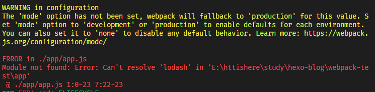
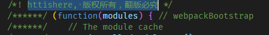

> `webpack` 是用于编译`Javascript 模块`, 可以看作是**模块打包机**(Webpack is a front-end tool to build JavaScript module scripts for browsers). 分析项目结构, 找到 Javascript 模块以及其他无法在浏览器上直接运行的拓展语言(Scss, TypeScript 等), 并将其转换和打包为合适的格式供浏览器使用。


`webpack`把所有文件都当作模块进行处理, Javascript 代码, css 文件, fonts 以及图片等都可以通过相应的`loader`被处理.

## 安装

```bash
npm install --save-dev webpack
// webpack 4+ 还需安装CLI
npm install --save-dev webpack-cli
```

通常，webpack 通过运行一个或多个`npm scripts`，会在本地`node_modules`目录中查找安装的 webpack：

```json
"scripts": {
    "start": "webpack --config webpack.config.js"
}
```

## 初始化

新建 webpack-demo 文件夹, 并通过`npm init`初始化, 生成 package.json 文件.

```json
// 最基本的package.json文件
{
  "name": "webpack-demo",
  "version": "1.0.0",
  "description": "webpack从入门到放弃",
  "main": "index.js",
  "scripts": {
    "test": "echo \"Error: no test specified\" && exit 1"
  },
  "author": "",
  "license": "ISC"
}
```

同时在根目录下新建 app 文件夹(存放原始数据与 Javascript 模块), public 文件夹(webpack 打包后生成的文件, 可供浏览器读取), 并创建一下文件:

- app.js (app 文件夹内)
- index.html (根目录)

```bash
  webpack-demo
  |- package.json
+ |- index.html
+ |- /app
+   |- app.js
```

index.html

```html
<!DOCTYPE html>
<html>
  <head>
    <title>Test</title>
  </head>
  <body>
    <div id="root"></div>
    <!-- bundle.js是打包后的文件 -->
    <script src="./public/bundle.js"></script>
  </body>
</html>
```

app.js 通过函数返回一个`html`元素内容, 并将返回的节点插入页面:

```js
function component() {
  var element = document.createElement("div");

  // Lodash(目前通过一个 script 脚本引入)对于执行这一行是必需的
  element.innerHTML = _.join(["Hello", "webpack"], " ");

  return element;
}

document.body.appendChild(component());
```

命令打包, 并浏览器打开 index.html, 可以正确输出`Hello webpack`:

```bash
webpack ./app/app.js ./public/bundle.js
```

## 配置文件

`webpack.config.js`也是一个简单的 Javascript 模块, 可以把需要的所有与打包相关的信息放在里面.

webpack.config.js

```js
module.exports = {
  entry: __dirname + "/app/app.js", //已多次提及的唯一入口文件
  output: {
    path: __dirname + "/public", //打包后的文件存放的地方
    filename: "bundle.js", //打包后输出文件的文件名
  },
};
```

**“\_\_dirname”是 node.js 中的一个全局变量，它指向当前执行脚本所在的目录。**

然后在终端使用命令时只需要输入`webpack`:

```bash
PS E:\webpack-test> webpack
Hash: a0b4d9f603147ef2aff1
Version: webpack 3.5.5
Time: 381ms
    Asset    Size  Chunks                    Chunk Names
bundle.js  545 kB       0  [emitted]  [big]  main
   [0] ./app/app.js 316 bytes {0} [built]
   [2] (webpack)/buildin/global.js 509 bytes {0} [built]
   [3] (webpack)/buildin/module.js 517 bytes {0} [built]
    + 1 hidden module
```

对`npm`进行配置可以在终端中使用简单的命令代替`webpack`命令, 做到命令的简化和统一:

```js
"scripts": {
    "test": "echo \"Error: no test specified\" && exit 1",
    "start": "webpack"
},
```

然后就可以使用`npm start`命令直接执行打包:

```basic
PS E:\webpack-test> npm start

> webpack-demo@1.0.0 start E:\webpack-test
> webpack

Hash: a0b4d9f603147ef2aff1
Version: webpack 3.5.5
Time: 352ms
    Asset    Size  Chunks                    Chunk Names
bundle.js  545 kB       0  [emitted]  [big]  main
   [0] ./app/app.js 316 bytes {0} [built]
   [2] (webpack)/buildin/global.js 509 bytes {0} [built]
   [3] (webpack)/buildin/module.js 517 bytes {0} [built]
    + 1 hidden module
```

## Webpack 其他功能

### Source Maps

`Source Maps`提供了一种对应编译文件和源文件的方法, 使编译后的代码可读性更高, 更容易调试, 可以帮助我们快速定位错误的地方, 通过配置`webpack`可以在打包时为我们生成`source maps`.

<style> table th:first-of-type { width: 100px; } </style>

| devtool 选项                 | 配置结果                                                                                                                                                                                                                                                |
| ---------------------------- | ------------------------------------------------------------------------------------------------------------------------------------------------------------------------------------------------------------------------------------------------------- |
| source-map                   | 在一个单独的文件中产生一个完整且功能完全的文件。这个文件具有最好的 source map，但是它会减慢打包速度；                                                                                                                                                   |
| cheap-module-source-map      | 在一个单独的文件中生成一个不带列映射的 map，不带列映射提高了打包速度，但是也使得浏览器开发者工具只能对应到具体的行，不能对应到具体的列(符号)，会对调试造成不便；                                                                                        |
| eval-source-map              | 使用 eval 打包源文件模块，在同一个文件中生成干净的完整的 source map。这个选项可以在不影响构建速度的前提下生成完整的 sourcemap，但是对打包后输出的 JS 文件的执行具有性能和安全的隐患。在开发阶段这是一个非常好的选项，在生产阶段则一定不要启用这个选项； |
| cheap-module-eval-source-map | 这是在打包文件时最快的生成 source map 的方法，生成的 Source Map 会和打包后的 JavaScript 文件同行显示，没有列映射，和 eval-source-map 选项具有相似的缺点；                                                                                               |

上表从上到下打包速度越来越快, 但是同时负担以及执行也会变大, 所以需要根据需要和项目需求选择, 并只在开发阶段使用.

```js
module.exports = {
  devtool: "eval-source-map",
  entry: __dirname + "/app/app.js", //已多次提及的唯一入口文件
  output: {
    path: __dirname + "/public", //打包后的文件存放的地方
    filename: "bundle.js", //打包后输出文件的文件名
  },
};
```

### 本地服务器 devServer

浏览器可以监听代码修改, 并自动刷新显示最新的修改结果.

```bash
npm install --save-dev webpack-dev-server
```

**PS: 需要注意 webpack 和 webpack-dev-server 的版本匹配;**

`devServer`的配置选项:

```js
module.exports = {
  ...
  devServer: {
    contentBase: "./public", // 本地服务器所加载的页面所在的目录, 默认webpack-dev-server会为根文件夹提供本地服务器
    historyApiFallback: true, // 在开发单页应用时非常有用，它依赖于HTML5 history API，如果设置为true，所有的跳转将指向index.html
    inline: true, // 设置为true，当源文件改变时会自动刷新页面
    port: '8888', // 设置默认监听端口，如果省略，默认为”8080“
  },
};
```

开启本地服务器的命令`webpack-dev-server --open`, 我们也可以在`package.json`内设置简化命令:

```json
  "scripts": {
    "test": "echo \"Error: no test specified\" && exit 1",
    "start": "webpack",
    "server": "webpack-dev-server --open"
  },
```

使用`npm run server`即可在本地的`8888`端口查看结果:

```bash
PS E:\webpack-test> yarn server
yarn run v1.12.3
$ webpack-dev-server --open --mode development
i ｢wds｣: Project is running at http://localhost:8888/
i ｢wds｣: webpack output is served from /
i ｢wds｣: Content not from webpack is served from ./public
i ｢wds｣: 404s will fallback to /index.html
i ｢wdm｣: Hash: b274af3ebd1d650a24a6
Version: webpack 4.42.1
Time: 701ms
Built at: 2020-04-20 1:40:47 PM
    Asset     Size  Chunks             Chunk Names
bundle.js  893 KiB    main  [emitted]  main
Entrypoint main = bundle.js
[0] multi (webpack)-dev-server/client?http://localhost:8888 ./app/app.js 40 bytes {main} [built]
```

**PS: `webpack`运行时可能会出现报错**


解决: 在命令中增加 mode 环境, `--mode development`, `–mode production`等.

```json
  "scripts": {
    "test": "echo \"Error: no test specified\" && exit 1",
    "start": "webpack",
    "server": "webpack-dev-server --open --mode development"
  },
```

### Loaders

`Loaders`是`webpack`强大的功能之一, 通过使用不同的`loader`, `webpack`可以调用外部的脚本或者工具, 实现对不同格式的文件的处理, 比如将 less 转成 css, ES6/ES7 转成现在浏览器兼容的 js 语法等.

`Loaders`需要单独安装并在`modules`关键字下进行配置:

- `test`: 用以匹配 loaders 所处理文件的拓展名的正则表达式(必填);
- `loader`: loader 的名称(必填);
- `include / exclude`: 手动添加必须处理的文件(文件夹)或屏蔽不需要处理的文件(文件夹)(可选);
- `query`: 为 loaders 提供额外的设置选项;

#### Babel

> 一个编译 Javascript 的平台, 可以支持使用的最新的 JS 代码(ES7,ES6 等), 也支持使用基于 JS 进行拓展的语言, 比如 React 的 JSX.

Babel 其实是几个模块化的包，其核心功能位于称为 babel-core 的 npm 包中，webpack 可以把其不同的包整合在一起使用，对于每一个你需要的功能或拓展，你都需要安装单独的包(用得最多的是解析 Es6 的 babel-env-preset 包和解析 JSX 的 babel-preset-react 包)。

```bash
// npm一次性安装多个依赖模块，模块之间用空格隔开
npm install --save-dev babel-core babel-loader babel-preset-env babel-preset-react
```

并在`webpack.config.js`内配置`Babel`:

```js
module.exports = {
  ...
  module: {
    rules: [
      {
        test: /(\.jsx|\.js)$/,
        use: {
          loader: "babel-loader",
          options: {
            presets: ["env", "react"],
          },
        },
        exclude: /node_modules/,
      },
    ],
  },
};
```

同时我们也可以将`Babel`配置独立处理, 单独存放在`.babelrc`的配置文件内, `webpack`会自动调用`.babelrc`里的 babel 配置信息.

```js
// .babelrc
{
  presets: ["env", "react"],
}

// webpack.config.js
{
  ...
  module: {
    rules: [
      {
        test: /(\.jsx|\.js)$/,
        use: {
          loader: "babel-loader",
          options: {
            presets: ["env", "react"],
          },
        },
        exclude: /node_modules/,
      },
    ],
  },
}
```

#### css

`webpack`提供了两个工具处理样式表, `css-loader`和`style-loader`, `css-loader`支持`@import`和`url(...)`的方法实现`require()`的功能, `style-loader`是将所有计算后的样式加入页面, 所以一般都是两者结合使用.

```bash
npm install --save-dev style-loader css-loader
```

在`rules`内配置, 然后就可以直接在 js 文件内使用`import`引入 css 文件:

```js
module.exports = {
  ...
  module: {
    rules: [
      {
        test: /(\.jsx|\.js)$/,
        use: {
          loader: "babel-loader",
        },
        exclude: /node_modules/,
      },
      {
        test: /\.css$/,
        use: [
          {
            loader: "style-loader",
          },
          {
            loader: "css-loader",
          },
        ],
      },
    ],
  },
};
```

> `CSS modules`把 JS 的模块化思想带入 CSS 中来，通过 CSS 模块，所有的类名，动画名默认都只作用于当前模块。`Webpack`对 CSS 模块化提供了非常好的支持，只需要在 CSS loader 中进行简单配置即可，然后就可以直接把 CSS 的类名传递到组件的代码中，这样做有效避免了全局污染。

```js
      {
        test: /\.css$/,
        use: [
          {
            loader: "style-loader",
          },
          {
            loader: "css-loader",
            options: {
              modules: true, // 指定启用css modules
              localIdentName: "[name]__[local]--[hash:base64:5]", // 指定css的类名格式
            },
          },
        ],
      },
```

[css module 官方文档](https://github.com/css-modules/css-modules)

主要的`css loaders`:

- `Less Loader`
- `Sass Loader`
- `Stylus Loader`
- `Postcss Loader`

可以使用`Postcss Loader`为 CSS 代码自动添加适应不同浏览器的 css 前缀.

```bash
# autoprefixer 自动添加前缀的插件
npm install --save-dev postcss-loader autoprefixer
```

在`use`内添加`postcss-loader`:

```js
      {
        test: /\.css$/,
        use: [
          {
            loader: "style-loader",
          },
          {
            loader: "css-loader",
            options: {
              modules: true, // 指定启用css modules
              localIdentName: "[name]__[local]--[hash:base64:5]", // 指定css的类名格式
            },
          },
          {
              loader: 'postcss-loader',
              plugins: [
                  require('autoprefixer')
              ]
          }
        ],
      }
```

### Plugins

loaders 是在打包构建过程中用来处理源文件的（JSX，Scss，Less..），一次处理一个，插件并不直接操作单个文件，它直接对整个构建过程其作用。

```js
// webpack.config.js
module.exports = {
  ...
  plugins: [
        new webpack.BannerPlugin('httishere, 版权所有，翻版必究')
  ],
}
```

打包生成的文件内:



#### 常用插件

- `HtmlWebpackPlugin`

  根据一个简单的 index.html 模板，生成一个自动引用你打包后的 JS 文件的新 index.html。这在每次生成的 js 文件名称不同时非常有用（比如添加了 hash 值）。

  ```js
  plugins: [
    ...
    new HtmlWebpackPlugin({
      template: __dirname + "/index.tmpl.html", //new 一个这个插件的实例，并传入相关的参数
    }),
  ],
  ```

- `Hot Module Replacement`

  支持修改组件代码后，自动刷新实时预览修改后的效果。

  1. 在 webpack 配置文件中添加 HMR 插件；
  2. 在`Webpack Dev Server`中添加“hot”参数；

  ```js
  plugins: [
    ...
    new webpack.HotModuleReplacementPlugin(), //热加载插件
  ],
  ```

### 不同环境下的配置更改

如果需要`production`环境, 创建`webpack.pro.config.js`:

```js
// webpack.pro.config.js

const webpack = require("webpack");
const HtmlWebpackPlugin = require("html-webpack-plugin");

module.exports = {
  devtool: "null",
  entry: __dirname + "/app/app.js", //已多次提及的唯一入口文件
  output: {
    path: __dirname + "/build", //打包后的文件存放的地方
    filename: "bundle.js", //打包后输出文件的文件名
  },
  devServer: {
    // contentBase: "", //本地服务器所加载的页面所在的目录
    historyApiFallback: true, //不跳转
    inline: true, //实时刷新
    port: 8888,
    hot: true,
  },
  module: {
    rules: [
      {
        test: /(\.jsx|\.js)$/,
        use: {
          loader: "babel-loader",
        },
        exclude: /node_modules/,
      },
      {
        test: /\.css$/,
        use: [
          {
            loader: "style-loader",
          },
          {
            loader: "css-loader",
          },
          {
            loader: "postcss-loader",
          },
        ],
      },
    ],
  },
  plugins: [
    new webpack.BannerPlugin("httishere, 版权所有，翻版必究"),
    new HtmlWebpackPlugin({
      template: __dirname + "/index.tmpl.html", //new 一个这个插件的实例，并传入相关的参数
    }),
    new webpack.HotModuleReplacementPlugin(), //热加载插件
  ],
};
```

本文参考:

- [入门 Webpack，看这篇就够了](https://www.jianshu.com/p/42e11515c10f)
- [webpack 中文文档](https://www.webpackjs.com/guides/getting-started/)
- [阮一峰 webpack demos](https://github.com/ruanyf/webpack-demos)
