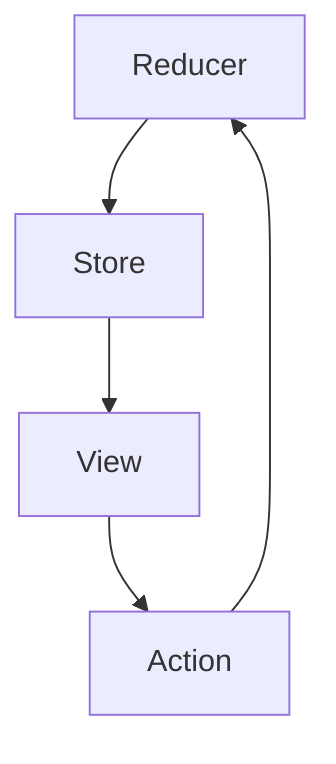

**Redux 是状态管理框架，基于不可变数据的机制。**

# Redux 的出现背景

原先的数据传递：组件级别的 state，从上而下的 props 两个状态机制。

但是无法满足类似跨层级的组件数据共享和传递。

## Redux Store 的特点

- **Redux Store 是全局唯一的。**
- **Redux Store 是树状结构。**

## 使用场景

- 跨组件的状态共享
- 同组件多个实例的状态共享

# 基本概念

- State：即 Store
- Action：用于描述发生的动作
- Reducer：接受 Action 和 State 作为参数通过计算得到新的 Store

## 好处：

- 保证数据的不可变性：**在 Reducer 内每次必须返回一个新的对象**
- 可预测性
- 易于调试：可以跟踪 Store 中数据的变化

## Redux 逻辑步骤

- 创建 store
- 利用 Action 和 Reducer 修改 Store
- 利用 subscribe 监听 store 变化

```typescript
import { createStore } from "redux";

const initStore = { value: 0 };

function counterReducer(state = initStore, action) {
  switch (action.type) {
    case "counter/incremented":
      return { value: state.value + 1 };
    case "counter/decremented":
      return { value: state.value - 1 };
    default:
      return state;
  }
}

const store = createStore(counterReducer);
store.subscribe(() => console.log(store.getState()));

const incrementAction = { type: "counter/incremented" };
const decrementAction = { type: "counter/decremented" };

store.dispatch(incrementAction);
store.dispatch(incrementAction);
store.dispatch(decrementAction);
```

# 使用方法

- React 组件能在依赖的 Store 的数据发生变化时重新 render
- 在 React 组件中，能够在某些时机去 dispatch 一个 action，从而出发 store 的更新

**需要在 React 内引入 react-redux 工具库，让 React 和 Redux 实现互通。**

为了确保需要绑定的组件能够访问到全局唯一的 Redux Store，需要利用 React 的 Context 机制去存放 Store 信息。

```typescript
import { Provider } from "react-redux";

ReactDOM.render(
  <Provider store={store}>
    <App />
  </Provider>,
  rootElement
);
```

**然后就可以利用 react-redux 提供的\*\***`useSelector`\***\*和\*\***`useDispatch`\***\*两个 Hooks 来使用 Redux 了。**

- `useSelector`：让组件在 Store 的某些数据发生变化时重新 render



# 利用 Redux 处理异步逻辑（异步 Action）

在 Store 内我们不仅维护着业务数据同时维护着应用程序的状态。

store 的主要变化：

- 请求发送时：设置`state.pending = true` → 用于 UI 显示加载中状态
- 请求发送成功：设置`state.pending = false, state.data = result` → 取消加载状态同时将获取的数据展示在 UI 上
- 请求发送失败：设置`state.pending = false, state.error = error` → 取消加载状态，设置错误状态和信息，用于在 UI 上显示错误内容

```typescript
function DataList() {
  const dispatch = useDispatch();
  useEffect(() => {
    dispatch({ type: "FETCH_START" });
    fetch("/xxx")
      .then((res) => {
        dispatch({ type: "FETCH_SUCCESS", data: res });
      })
      .catch((err) => {
        dispatch({ type: "FETCH_ERROR", error: err });
      });
  }, []);
  const data = useSelector((state) => state.data);
  const pending = useSelector((state) => pending);
  const error = useSelector((state) => error);
  if (error) return "Error";
  if (pending) return "Loading...";
  return <Table data={data} />;
}
```

在上述代码中使用三个同步 Action 完成这个异步请求的场景，这里将 store 完全作为一个存放数据的地方。

发送请求获取数据并进行错误处理的逻辑是不可重用的，如果在另一个组件中也使用同样的请求就需要在组件内重新实现一遍。

因此 Redux 提供了**middleware**机制可以巧妙地实现异步 Action 的概念。

middleware 可以让你提供一个拦截器在 reducer 处理 action 之前被调用，在拦截器内可以自由地处理获得的 action。

**Action → Middleware → Reducer**

然后 Redux 提供了 react-thunk 的中间件，它如果发现接收到的 action 是一个函数，那么就不会传递给 reducer 而是执行这个函数，并把 dispatch 作为参数传给这个函数。

```typescript
import { createStore, applyMiddleware } from "react";
import thunkMiddleware from "redux-thunk";
import rootReducer from "./reducer";

const composedEnhancer = applyMiddleware(thunkMiddleware);
const store = createStore(rootReducer, composeEnhancer);
```

```typescript
function fetchData() {
  return (dispatch) => {
    dispatch({ type: "FETCH_START" });
    fetch("/xxx")
      .then((res) => {
        dispatch({ type: "FETCH_SUCCESS", data: res });
      })
      .catch((err) => {
        dispatch({ type: "FETCH_ERROR", error: err });
      });
  };
}
```

```javascript
function DataList2() {
  const dispatch = useDispatch();
  dispatch(fetchData());
}
```

**通过这种方式就可以实现异步请求的重用，这一套结合 redux-thunk 中间件的机制称之为异步 Action（更像是 Redux 的使用模式，通过组合使用同步 Action 用一致的方式提供处理异步逻辑的方案）。**

# 思考题

只考虑 Redux，如何在计数器内实现指定的变量值。
