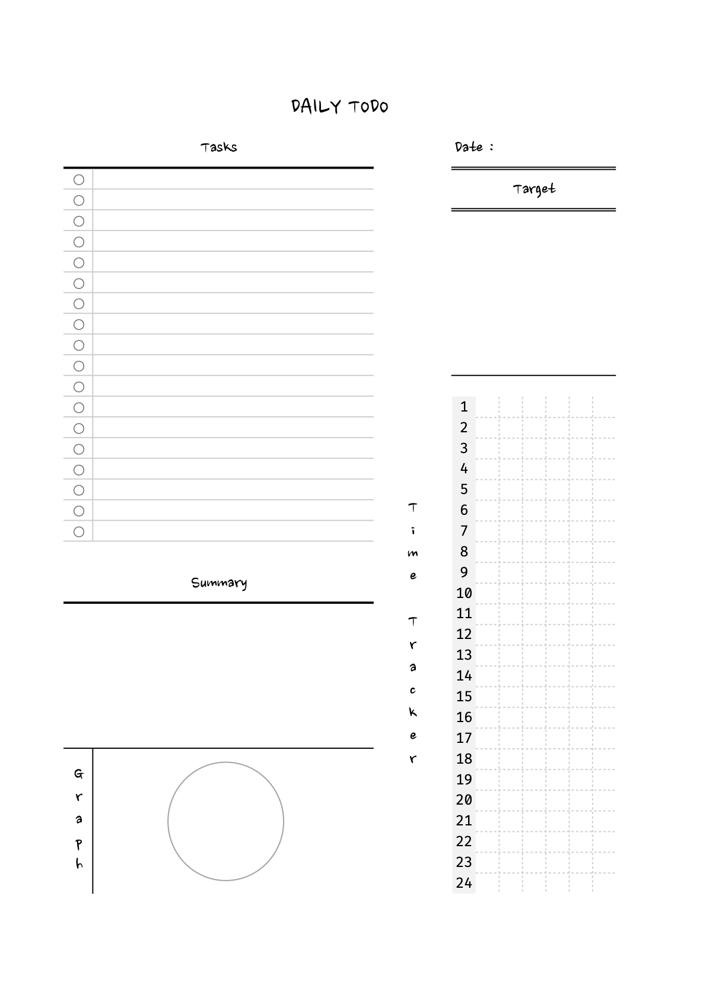
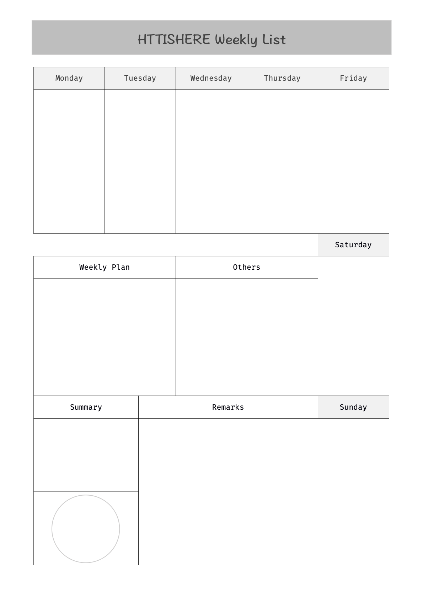
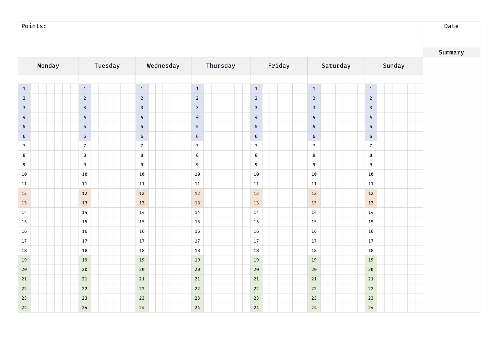
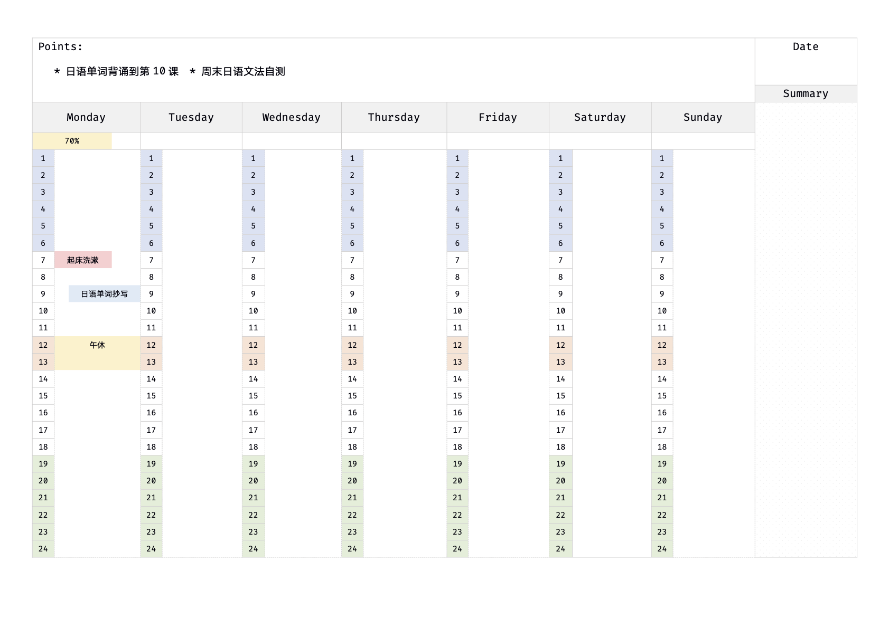

> 部分计划表模版

### 日计划表

#### Daily TODO 01

- Tasks：今日任务
- Date：本日日期
- Target：本日目标
- Time Tracker：本日日程时间表（10分钟为单位）
- Summary：今日总结
- Graph：今日日程时间安排分布

[Weekly List Pdf Download](Daily-TODO.pdf)

### 周计划表

#### Weekly list 01

- Weekly plan：一周总计划
- Others：计划之外的行程安排或者学习内容等
- Circle：每周任务的时间规划分配
- Summary：一周总结，可以记录任务完成度等等
- Remarks：标记，可以根据自己的规划标记一些重点部分
- Weekday：当日计划

[Weekly List Pdf Download](Weekly-List.pdf)

#### Weekly List 02

- Points：记录本周重点内容
- Date：本周日期，如：2020/12/21-2020/12/25
- Weekday：列了当日24小时段，每一小时段分为6小段（10分钟为时间颗粒），星期下方为当日完成度，可填写百分比等
- Summary：本周总结
  
[Weekly Points Pdf Download](Weekly-Points2.pdf)

### 月计划表
