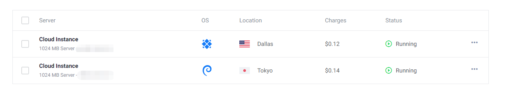

#### 购买服务器

- 注册vultr, [vultr官网](https://www.vultr.com/);
- 测试速度选择节点;
- 充值, 最低充值为10刀;

- 搭建服务器, 点击右侧加号, 依次选择Server Location, Server Type(CentOS 7*64), Server Size($5/mon), 然后点击Deploy Now, 等待安装完成;

点击可查看服务器详情:

#### 远程服务器配置

